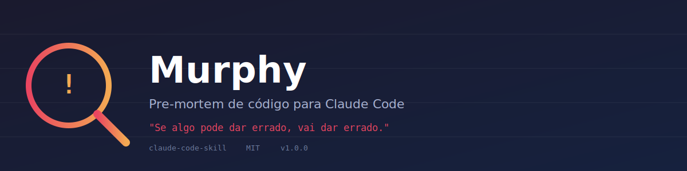

<p align="center">
  
</p>

<p align="center">
  
</p>

# 🔍 Murphy

> "Se algo pode dar errado, vai dar errado."

<p align="center">
  <a href="https://github.com/PedroHrr-css/murphy-skill/stargazers"></a>
  <a href="https://github.com/PedroHrr-css/murphy-skill/releases"></a>
  <a href="./LICENSE"></a>
  
</p>

Uma skill para [Claude Code](https://claude.com/claude-code) que faz um **pre-mortem** da sua request antes de qualquer alteração no código. Murphy analisa suposições implícitas, ambiguidades, reversibilidade e efeitos colaterais — e só te interrompe quando o risco é real.

## O que ela faz

Antes de usar qualquer ferramenta (editar arquivo, rodar bash, migration, etc.), Murphy passa a request por um checklist:

1. **Suposições implícitas** — o que está sendo assumido sem o usuário ter dito?
2. **Ambiguidade** — existe mais de uma leitura razoável do pedido?
3. **Reversibilidade** — dá pra desfazer fácil ou é destrutivo (delete, drop, force push)?
4. **Efeitos colaterais** — pode quebrar algo fora do escopo mencionado?
5. **Dependências frágeis** — depende de algo que pode não existir ou estar desatualizado?

Riscos **leves** são listados e o trabalho segue normalmente. Riscos **graves** (irreversíveis ou destrutivos) fazem Murphy parar e perguntar antes de agir.

## Instalação

Escolha **um** dos três níveis abaixo de acordo com o quanto você quer que Murphy intervenha, e copie o arquivo correspondente.

| Nível | Quando dispara | Arquivo |
|---|---|---|
| **Manual** | Só quando você digitar `/murphy` | `variants/SKILL-manual.md` |
| **Guarded** (recomendado) | Automático, só em risco real (ações destrutivas, ambiguidade, mudanças em algo compartilhado) | `variants/SKILL-guarded.md` |
| **Watchful** | Automático, em praticamente toda request de código | `variants/SKILL-watchful.md` |

### Passo a passo

```bash
# Escolha pessoal (qualquer projeto)
mkdir -p ~/.claude/skills/murphy
cp variants/SKILL-guarded.md ~/.claude/skills/murphy/SKILL.md

# OU escopo de projeto (versionado com o time)
mkdir -p .claude/skills/murphy
cp variants/SKILL-guarded.md .claude/skills/murphy/SKILL.md
```

Troque `SKILL-guarded.md` por `SKILL-manual.md` ou `SKILL-watchful.md` conforme o nível desejado.

Se você criou um diretório de skills que não existia antes (primeira skill pessoal ou de projeto), reinicie a sessão do Claude Code para que ele seja observado. Edições em uma skill já existente são detectadas ao vivo, sem precisar reiniciar.

## Exemplos

Veja [`examples/`](./examples) para casos reais de antes/depois — o que aconteceria sem Murphy vs. com Murphy, em situações como force push, limpeza ambígua de código e mudanças em endpoints já em uso.

## Testando

```
/murphy
```

ou simplesmente peça algo arriscado, por exemplo:

```
delete a tabela de usuários antigos e recria do zero
```

No modo guarded ou watchful, Murphy deve parar e perguntar antes de executar.

Para um conjunto completo de casos de teste (positivos e negativos), veja [`TESTS.md`](./TESTS.md) e [`evals/evals.json`](./evals/evals.json).

## Estrutura do repositório

```
murphy-skill/
├── README.md
├── LICENSE
├── CONTRIBUTING.md
├── CHANGELOG.md
├── TESTS.md
├── examples/
│   ├── README.md
│   ├── 01-force-push.md
│   ├── 02-limpeza-ambigua.md
│   └── 03-breaking-api-change.md
├── variants/
│   ├── SKILL-manual.md
│   ├── SKILL-guarded.md
│   └── SKILL-watchful.md
├── evals/
│   └── evals.json
└── assets/
    └── banner.svg
```

## Trocando de nível depois

Basta sobrescrever o `SKILL.md` instalado com o conteúdo de outra variante em `variants/`. Não precisa reiniciar — é o mesmo arquivo sendo editado.

## Contribuindo

Veja [`CONTRIBUTING.md`](./CONTRIBUTING.md) para reportar falsos positivos/negativos ou propor mudanças no checklist.

## Licença

MIT — veja [`LICENSE`](./LICENSE).
